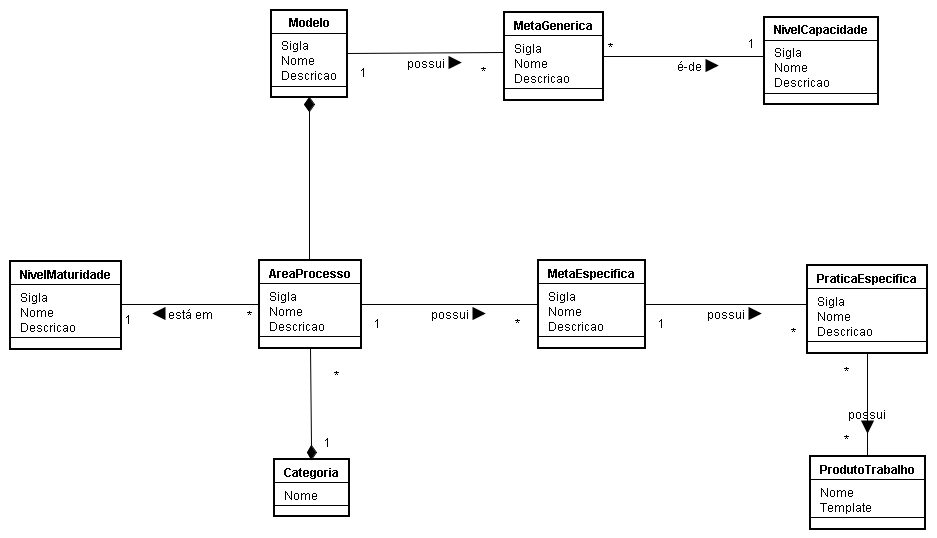

# Modelo de Processos

Trabalho da cadeira de Modelos de Melhoria de Processo de Software.

Uma ferramenta desenvolvida para gerenciar informações de um modelo de referência de processo de software.

## Instalação

``` bash
# Clone o repositório
git clone git@github.com:ftonato/modelo-de-processos.git && cd modelo-de-processos

# Instalar as dependências
cd backend && npm install
cd frontend && npm install

# Servidor backend ~ http://localhost:3000/
npm run dev

# Servidor frontend com 'hot reload' ~ http://localhost:8080/
npm run dev
```

## Descrição do projeto

### Objetivo
Desenvolver uma ferramenta que permita cadastrar e visualizar informações de um modelo de referência de processo de software.

### Funcionalidades básicas
A ferramenta deve permitir registrar informações relativas a um modelo de referência, como áreas de processo, metas específicas, níveis de maturidade e demais componentes do modelo.

A figura abaixo apresenta um modelo de domínio da ferramenta contendo as principais classes de domínio.



As funcionalidades esperadas são:
- **Cadastro do Modelo de Referência (ex: CMMI, MPS.BR, ZZZ, etc)**
Informações gerais sobre o modelo.

- **Cadastro de Áreas de Processo**
Permite cadastrar as áreas de processo do modelo. As áreas de processos podem ser estar agrupadas em Categorias e também relacionadas a níveis de maturidade.

- **Cadastro de Categorias de Processo**

- **Cadastro de Metas Específicas e Práticas Específicas**
Permite cadastrar metas e práticas específicas para cada área de processo, contendo dados como sigla, nome e descrição.

- **Cadastro de Nível de Maturidade**
Informações sobre os níveis de maturidade do modelo e quais áreas de processos fazem parte de cada nível.

- **Níveis de Capacidade**
Permite cadastrar os níveis de capacidade do modelo.

- **Cadastro de Metas Genéricas**
Permite cadastrar metas genéricas do modelo ligadas a níveis de capacidade do mesmo.

- **Cadastro e Upload de Produtos de Trabalho Típicos**
Permite armazenar os templates para os produtos de trabalho típicos ligados a práticas específicas. Um produto de trabalho típico pode ser usado em mais de uma prática específica. A ferramenta deve fazer um upload do template do PT armazenando o mesmo.

- **Visualização de Informações do Modelo**
A ferramenta deve oferecer uma funcionalidade que permita ao usuário visualizar as informações de cada modelo, mostrando as áreas de processo, metas, etc.

- **Exportação das Informações**
Permitir exportar os dados do modelo para um formato .PDF ou .DOCX.

### Validação da Ferramenta
Para testar a ferramenta devem ser cadastrados pelo menos as informações referentes ao CMMI e ao MPS.BR.

### Tecnologia
Pode ser utilizada qualquer tecnologia. A preferência é por uma ferramenta web, disponível para acesso pela internet.

## License
Este projeto é licenciado sob a licença MIT. Veja o arquivo [LICENSE](LICENSE) para mais detalhes.
